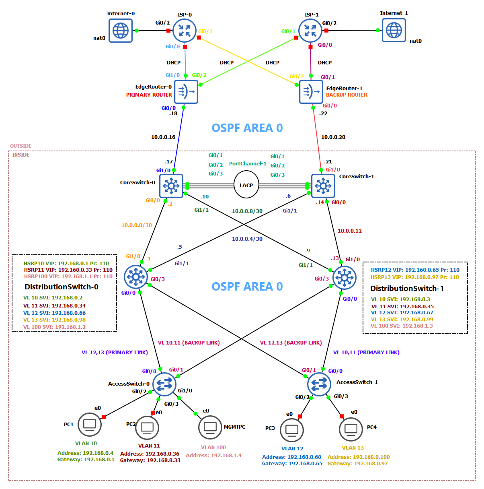

# Redundant Three-Tier Enterprise Network
Project simulates Three-Tier architecture with Dual ISP failover (with Internet access via GNS3 NAT), using Cisco devices (Routers, switches) and VPCS representing computers only to test connectivity.

Designed to explore LAN architecture, redundancy and multilayer switching beyond the CCNA level.

> The IP range `203.0.113.x`, `198.51.100.x` follows RFC 5737 designated only as TEST-NET-2 documentation.

## Topology

# Network Devices
| **Name**             | **Description**                                                                                          | **Rest**                     |
|----------------------|----------------------------------------------------------------------------------------------------------|------------------------------|
|    AccessSwitch-0    | Access layer, primary switch for VLAN 10,11,100                                                          | Default Gateway: 192.168.1.1 |
|    AccessSwitch-1    | Access layer, primary switch for VLAN 12,13                                                              | Default Gateway: 192.168.1.1 |
| DistributionSwitch-0 | Distribution layer, Inter-VLAN routing, primary gateway for VLAN 10,11,100 and VLAN 12,13 backup gateway |   Loopback address: 1.1.1.1  |
| DistributionSwitch-1 | Distribution layer, Inter-VLAN routing, VLAN 10,11,100 primary gateway and VLAN 12,13 backup gateway     |   Loopback address: 2.2.2.2  |
|     CoreSwitch-0     | Core layer, primary multilayer switch to outside network, fast forwarding (LACP) with CoreSwitch-1       |   Loopback address: 3.3.3.3  |
|     CoreSwitch-1     | Core layer, backup multilayer switch to outside network, fast forwarding (LACP) with CoreSwitch-0        |   Loopback address: 4.4.4.4  |
|     EdgeRouter-0     | Edge layer, primary path to Internet via ISP-0, NAT forwarder and failover                               |   Loopback address: 5.5.5.5  |
|     EdgeRouter-1     | Edge layer, backup path to Internet via ISP-1, NAT forwarder and failover                                |   Loopback address: 6.6.6.6  |
|         ISP-0        | WAN, Primary routing service to Internet                                                                 |               -              |
|         ISP-1        | WAN, Backup routing service to Internet                                                                  |               -              |
 

# All features with details
Here is the list of all technology and protocols that have been used in the the project.

> [!WARNING]
> I am currently still working on the project there might be some upgrades in the future. Please check updates to be aware of any changes.

## Switching

| Name       | Description                                                          |
|------------|----------------------------------------------------------------------|
| Rapid-PVST | DS-0 Root bridge for VLAN 10,11,100, DS-1 Root bridge for VLAN 12,13 |
| Trunking   | 802.1Q, Native VLAN 999                                              |
| EtherChannel | PortChannel-1 using LACP (active mode) between CoreSwitch-0 ==> CoreSwitch-1

## Routing

| Name          | Description                                                                                                                      |
|---------------|----------------------------------------------------------------------------------------------------------------------------------|
| OSPF          | Area 0, router IDs via loopback addresses, default route on CS-0 and CS-1, no DR/BDR selection, passive interfaces only on VLANs |
| NAT           | PAT on ER-0 (Inside: G0/0) and ER-1 (Inside: G0/0) for hosts using ACL: VLAN_NAT, BACKUP_VLAN_NAT                                |
| IP SLA        | Testing connectivity to Internet to address 8.8.8.8, frequency 10, timeout 5000, threshold 5000                                  |
| Static routes | Static route (0.0.0.0) to Internet via ISP-0, ISP-1 created on ER-0 and ER-1                                                     |
| ICMP          | Used by IP SLA to test connectivity to Internet

## Services (For more details please navigate to Windows Server project)
| Name   | Description                                                                                                                                                    |
|--------|----------------------------------------------------------------------------------------------------------------------------------------------------------------|
| DNS    | DNS for LAN, Windows Server with forwarder to remote host (8.8.8.8, 8.8.4.4)                                                                                   |
| DHCP   | Automation for IPs assigning, Windows Server, VLAN 10,11,12,13,100                                                                                             |
| NTP    | planned                                                                                                                                                        |
| AD     | Active Directory, domain controller on Windows Server                                                                                                          |
| HSRP   | Gateway redundancy for all VLANs, DS-0 and DS-1 function as primary gateway and backup for all VLANs in the LAN, Priority 110 (Primary), Priority 100 (Backup) |
| Syslog | planned                                                                                                                                                        |

