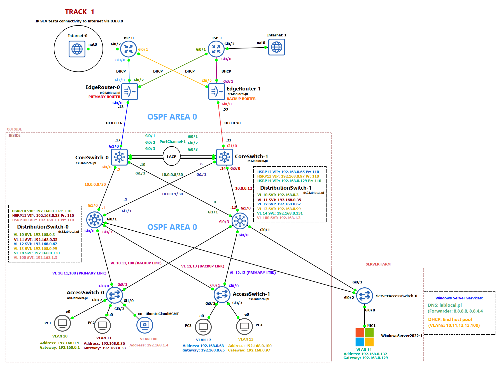

# Enterprise Network Architecture
Project simulates Four-Tier architecture with Dual ISP failover (with Internet access via GNS3 NAT), using Cisco devices (Routers, switches) and VPCS representing computers only to test connectivity.

Designed to explore LAN architecture, redundancy and multilayer switching beyond the CCNA level.

> The IP ranges 203.0.113.0/24 (TEST-NET-3) and 198.51.100.0/24 (TEST-NET-2) are reserved for documentation purposes only, defined in RFC 5737.

## Topology

# Network Devices
| **Name**             | **Description**                                                                                          | **Rest**                     |
|----------------------|----------------------------------------------------------------------------------------------------------|------------------------------|
|    AccessSwitch-0 (AS-0)    | Access layer, primary switch for VLAN 10,11,100                                                          | Default Gateway: 192.168.1.1 |
|    AccessSwitch-1 (AS-1)    | Access layer, primary switch for VLAN 12,13                                                              | Default Gateway: 192.168.1.1 |
|    ServerAccessSwitch-0 (SAS-0) | Access layer, primary switch for VLAN 14 (only for server farm)                                      | Default Gateway: 192.168.0.129 |
| DistributionSwitch-0 (DS-0) | Distribution layer, Inter-VLAN routing, primary gateway for VLAN 10,11,100 and VLAN 12,13 backup gateway |   Loopback address: 1.1.1.1  |
| DistributionSwitch-1 (DS-1) | Distribution layer, Inter-VLAN routing, VLAN 10,11,100 primary gateway and VLAN 12,13 backup gateway     |   Loopback address: 2.2.2.2  |
|     CoreSwitch-0 (CS-0)     | Core layer, primary multilayer switch to outside network, fast forwarding (LACP) with CoreSwitch-1       |   Loopback address: 3.3.3.3  |
|     CoreSwitch-1 (CS-1)     | Core layer, backup multilayer switch to outside network, fast forwarding (LACP) with CoreSwitch-0        |   Loopback address: 4.4.4.4  |
|     EdgeRouter-0 (ER-0)     | Edge layer, primary path to Internet via ISP-0, NAT forwarder and failover                               |   Loopback address: 5.5.5.5  |
|     EdgeRouter-1 (ER-1)     | Edge layer, backup path to Internet via ISP-1, NAT forwarder and failover                                |   Loopback address: 6.6.6.6  |
|         ISP-0        | WAN, Primary routing service to Internet                                                                 |               -              |
|         ISP-1        | WAN, Backup routing service to Internet                                                                  |               -              |
 

# All features with details
Here is the list of all technology and protocols that have been used in the the project.

> [!WARNING]
> I am currently still working on the project there might be some upgrades in the future. Please check updates to be aware of any changes.

## Switching

| Name       | Description                                                          |
|------------|----------------------------------------------------------------------|
| Rapid-PVST | DS-0 Root bridge for VLAN 10,11,100, DS-1 Root bridge for VLAN 12,13,14 |
| PortFast | Configured on AS-0, AS-1 and SAS-0 |
| BPDU Guard | Configured on AS-0, AS-1 and SAS-0 |
| Trunking   | 802.1Q, Native VLAN 999                                              |
| EtherChannel | PortChannel-1 using LACP (active mode) between CoreSwitch-0 ==> CoreSwitch-1 |

## Routing

| Name          | Description                                                                                                                      |
|---------------|----------------------------------------------------------------------------------------------------------------------------------|
| OSPF          | Area 0, router IDs via loopback addresses, default route on ER-0 and ER-1, no DR/BDR selection, passive interfaces only on VLANs |
| NAT           | PAT on ER-0 (Inside: G0/0) and ER-1 (Inside: G0/0) for hosts using ACL: VLAN_NAT, BACKUP_VLAN_NAT                                |
| IP SLA        | Testing connectivity to Internet to address 8.8.8.8, frequency 10, timeout 5000, threshold 5000                                  |
| Static routes | Static route (0.0.0.0) to Internet via ISP-0, ISP-1 created on ER-0 and ER-1                                                     |
| ICMP          | Used by IP SLA to test connectivity to Internet

## Services (For more details please navigate to Windows Server project)
| Name   | Description                                                                                                                                                    |
|--------|----------------------------------------------------------------------------------------------------------------------------------------------------------------|
| DNS    | DNS for LAN, Windows Server with forwarder to remote host (8.8.8.8, 8.8.4.4)                                                                                   |
| DHCP   | Automation for IPs assigning, Windows Server, VLAN 10,11,12,13,100, DHCP relay agent on DS-0 and DS-1                                                                                             |
| NTP    | planned                                                                                                                                                        |
| AD     | Active Directory, domain controller on Windows Server                                                                                                          |
| HSRP   | Gateway redundancy for all VLANs, DS-0 and DS-1 function as primary gateway and backup for all VLANs in the LAN, Priority 110 (Primary), Priority 100 (Backup) |
| NAT failover | Double NAT to ISP-0 and ISP-1, using Cisco if-then policy (route map)                                                                                    |
| Syslog | planned                                                                                                                                                        |

> [!NOTE]
> The GNS3 NAT node may have issues resolving DNS queries. Sometimes LAN hosts need access to Internet-0 and Internet-1 to be able to send traffic to external network like Google's DNS.

## Security and hardening devices
| Name                  | Description                                                                                                                                        |
|-----------------------|----------------------------------------------------------------------------------------------------------------------------------------------------|
| Line access           | Securing VTY line and console line using secret password and service encryption                                                                    |
| SSH hardening         | VTY lines 0-15 can only be accessed by SSH, 2048b crypto key, 5 minutes exec-timeout                                                               |
| ACL                   | Network devices only accept VLAN 100 for management                                                                                                |
| Port Security         | Access ports, sticky mac addresses, violation restrict (syslog planned)                                                                            |
| ARP Inspection (DAI)  | IP SRC-MAC DST-MAC validation, securing LAN from MitM attacks and ARP spoofing, limit rate 30, enabled on AS-0 and AS-1, uplinks marked as trusted |
| DHCP Snooping         | Securing LAN from rogue DHCP servers, limit rate 10, enabled on AS-0 and AS-1, uplinks marked as trusted                                           |

## Verification

## Tools and sources used
- GNS3 Virtual Machine, Version: 2.2.56.1
- GNS3 GUI, Version: 2.2.56.1
- Windows Server 2022 21H2
- Ubuntu Cloud Desktop 25.10 (Questing Quokka)
- Cisco documentation [Link to website](https://www.cisco.com/c/en/us/tech/index.html)
- Microsoft Learn [Link to webiste](https://learn.microsoft.com/pl-pl/troubleshoot/windows-server/welcome-windows-server)
- GNS3 Documentation [Link to webiste](https://docs.gns3.com/docs/)

# Author
**Szymon Garncarz**
 
_Aspiring Network Enginner | CCNA CSCO15045190_

# Links
My profile on **LinkedIn** 
[Link to linkedIn](https://www.linkedin.com/in/szymongarncarz/)

